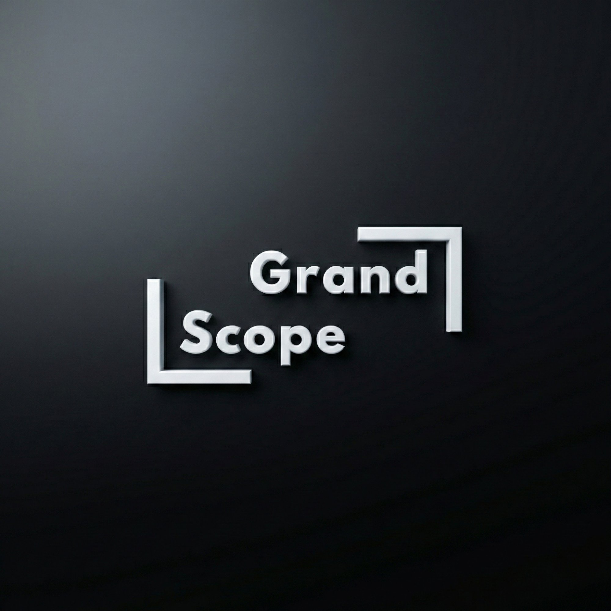
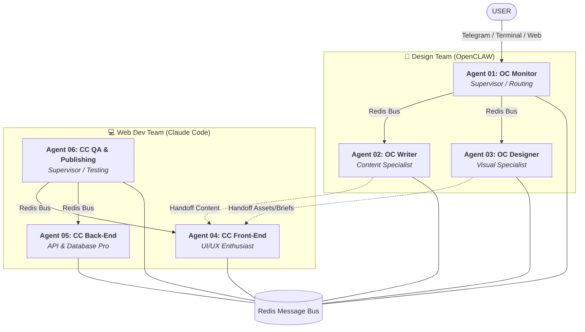

<div align="center">
  
  <h1>🌌 GrandScope AI</h1>
  <p><b>6 AI Agents · Automated Workflows · Hybrid Cost Routing</b></p>
  
  [](LICENSE)
  [](STATUS)
  [](TECH)
  [](ARCHITECTURE)
</div>

---

## 🌟 Overview

**GrandScope AI** is a cutting-edge multi-agent ecosystem designed to automate a complete digital agency. Running on a single VPS, it coordinates 6 specialized AI agents that collaborate via a **Redis Message Bus** to handle content creation, visual design, and full-stack web development with zero manual intervention.

> [!IMPORTANT]
> **Hybrid Cost Routing Engine**: Reduces API spend by 60-80% by dynamically selecting models (DeepSeek, Llama, Gemini, Claude, GPT-4o) based on task complexity scores (1-10).

---

## 🏗️ System Architecture

The ecosystem is divided into two specialized parallel teams, each overseen by a Supervisor Agent.



---

## 🎭 The Agent Roster

### 🎨 Design Team (OpenCLAW)
*   **Agent 01: OC Monitor (Supervisor)**: 24/7 health monitoring, task routing, cost tracking ($), and Telegram alerts.
*   **Agent 02: OC Content Writer**: Expert in SEO, tone modulation, and long-form content (22+ formats).
*   **Agent 03: OC Designer**: Generates assets (DALL-E 3, Runway), branding kits, and Figma tokens.

### 💻 Web Dev Team (Claude Code)
*   **Agent 04: CC Front-End**: Responsive React/Next.js UIs, accessibility (WCAG), and atomic design.
*   **Agent 05: CC Back-End**: API design (REST/GraphQL), DB schemas, and Docker orchestration.
*   **Agent 06: CC QA & Publishing (Supervisor)**: Continuous testing, security scans, and auto-rollback deployments.

---

## ✨ Key Technical Features

- **🧠 Hybrid Cost Routing**: 70% of routine tasks are routed to **Free/Budget models** (DeepSeek V3, Llama 3.3, Gemini Flash). Premium models (Claude 3.5 Sonnet, GPT-4o) are only engaged for complex reasoning.
- **🔄 Redis-Powered Handoffs**: Agents publish tasks to specialized channels. A designer and developer can work in parallel, slashing build times by 50%.
- **🛠️ Skill-Based System**: Each agent loads modular `.skill.md` files at startup, allowing for easy updates to their domain-specific logic.
- **🛡️ Quality Gateways**: Supervisor agents (01 & 06) review all outputs against rubrics (SEO rules, accessibility, performance budgets) before delivery.

---

## � Setup & Installation

### Prerequisites
- **Recommended VPS**: Hetzner CX31 (2 vCPU, 8GB RAM, 80GB NVMe) - approx. $10/mo.
- **Services**: OpenRouter (Primary API), Anthropic, Redis, Docker.

### Manual Installation
1.  **Clone & Install Dependencies**:
    ```bash
    git clone https://github.com/yourusername/grandscope-ai.git
    cd grandscope-ai && npm install
    ```
2.  **Environment Configuration**:
    ```bash
    cp .env.template .env
    # Add your API Keys, Redis Password, and Telegram Bot Tokens
    ```
3.  **Launch with PM2**:
    ```bash
    pm2 start infrastructure/pm2/ecosystem.config.js
    pm2 status # Verify all 6 agents show 'online'
    ```

### Docker Deployment (Recommended)
```bash
docker-compose up -d --build
```

---

## 📁 Repository Structure

```text
├── agents/             # Logic for all 6 specialized agents
│   ├── oc-monitor/     # Supervisor 01
│   ├── oc-writer/      # Content Writer 02
│   ├── oc-designer/    # Visual Designer 03
│   ├── cc-frontend/    # UI Developer 04
│   ├── cc-backend/     # API Developer 05
│   └── cc-monitor/     # QA & Supervisor 06
├── shared/             # Redis client, cost models, and global utilities
├── outputs/            # Final artifacts (Content, Designs, Code)
├── Dockerfiles.*       # Per-agent container configs
└── docker-compose.yml  # Multi-agent orchestration
```

---

## � Support & Reports
GrandScope AI is designed to be low-touch. You will receive:
- **Instant Alerts**: Telegram notifications for CRITICAL errors.
- **Daily Digest**: A midnight report summarizing tasks completed, costs, and system uptime.
- **Deployment Reports**: Build results, Lighthouse scores, and live URLs.

---

<div align="center">
  <p><i>Proprietary Technology - March 2026. All rights reserved.</i></p>
</div>
